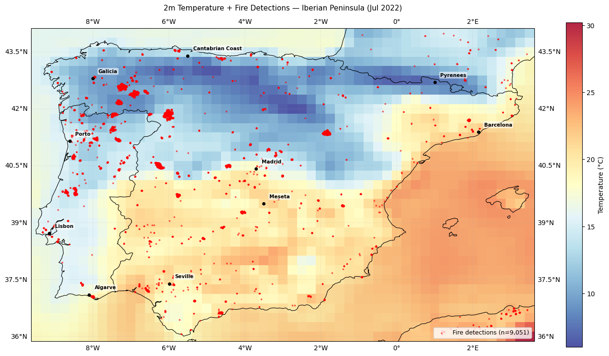

# Wildfire Spotting From Weather Anomalies

> Predicting wildfire ignition risk 72 hours in advance across the Iberian Peninsula using atmospheric anomaly patterns and compound weather indices; built end-to-end from data ingestion to deployed API and live risk dashboard.

---

## The Problem

Most wildfire prediction systems rely on simple temperature thresholds. But temperature alone doesn't start fires.

Catastrophic wildfires emerge from **compounding atmospheric conditions**; a rapid humidity drop, sustained wind shift, weeks of soil moisture deficit, and above-average temperatures converging in the same place at the same time. This project captures those rare, dangerous combinations and translates them into a 72-hour ignition risk score at 0.25° spatial resolution across the Iberian Peninsula.

The July 2022 Portugal fires, one of Europe's worst in decades showed exactly this pattern: the densest fire clusters appeared not in the hottest zone, but in the northwest transitional zone where Atlantic moisture gradients met dry inland conditions.

---

## How It Works

```
NOAA GFS Forecast (72hr)
        │
        ▼
Feature Engineering ──── ERA5 Historical Baseline
        │                        │
        │   Anomaly Detection ◄──┘
        │   (z-scores, compound indices, dry streaks)
        ▼
   ML Model
        │
        ▼
Risk Score API (FastAPI)
        │
        ▼
Live Risk Dashboard
```

---

## Key Features

- **72-hour forward prediction** — operationally useful for evacuation planning and resource pre-positioning
- **Anomaly-based features** — rolling z-scores, Fosberg Fire Weather Index, Haines Index, consecutive dry days, rapid humidity drops
- **Full ML pipeline** — from raw atmospheric data to deployed API with model versioning and drift monitoring
- **Explainable outputs** — SHAP values show which atmospheric conditions drive each risk prediction
- **Backtested on real events** — validated against the July 2022 Iberian Peninsula fire season

---

## Data Sources

| Source | Data | Coverage |
|---|---|---|
| ERA5 (Copernicus/ECMWF) | Temperature, humidity, wind, soil moisture, pressure | 2015–2023 historical |
| NOAA GFS | 72-hour atmospheric forecasts | Real-time |
| NASA FIRMS (VIIRS SNPP) | Historical fire detection points | 2015–2023 |
| EFFIS (EU JRC) | Fire perimeter and ignition data | 2015–2023 |
| SRTM | Elevation, slope, aspect | Static |

---

## Tech Stack

| Layer | Tools |
|---|---|
| Data ingestion | Python, cdsapi, NASA FIRMS API |
| Spatial processing | GeoPandas, Xarray, Cartopy |
| Modeling | - |
| Experiment tracking | MLflow |
| Hyperparameter tuning | - |
| API serving | FastAPI |
| Containerization | Docker |
| Orchestration | Apache Airflow |
| Database | PostgreSQL |
| Dashboard | - |
| Cloud deployment | GCP Cloud Run |
| Monitoring | Evidently AI |

---

## Project Structure

```
wildfire-spotting/
├── data/
│   ├── raw/              # ERA5, FIRMS, EFFIS raw downloads
│   ├── processed/        # Feature-engineered grid datasets
│   └── external/         # SRTM topography, static reference data
├── notebooks/
│   ├── 01_era5_exploration.ipynb
│   ├── 02_firms_exploration.ipynb
│   └── 03_feature_engineering.ipynb
├── src/
│   ├── ingestion/        # ERA5, FIRMS, EFFIS ingestion scripts
│   ├── features/         # Anomaly detection, compound indices
│   ├── models/           # Training, evaluation, SHAP analysis
│   ├── api/              # FastAPI app and endpoints
│   └── pipeline/         # Prefect orchestration flows
├── tests/
├── configs/
│   └── config.yaml       # Region, resolution, date range settings
├── mlruns/               # MLflow experiment tracking
├── Dockerfile
└── README.md
```

---

## Region

**Iberian Peninsula** (Portugal + Spain)
- Bounding box: 36°N–44°N, 9.5°W–3.5°E
- Spatial resolution: 0.25° (~28km grid cells)
- Temporal resolution: 6-hourly atmospheric inputs

Portugal has one of the highest fire-to-land-area ratios in Europe. The 2022 fire season alone burned over 110,000 hectares. This region offers high-quality historical data, a severe real-world problem, and an underserved market for prediction tooling compared to the US.

---

## Exploratory Findings



> 9,051 VIIRS fire detections overlaid on ERA5 surface temperature, July 2022. Dense clusters in Galicia and NW Portugal appear in the **coolest zone** of the map — not the hottest. The fuel-sparse Meseta plateau records peak temperatures but relatively few ignitions. This directly validates the project's core hypothesis: compounding atmospheric conditions are stronger ignition predictors than temperature alone.


## Status

- [x] ERA5 atmospheric data ingestion
- [x] NASA FIRMS fire detection ingestion
- [x] EFFIS fire perimeter ingestion
- [x] Feature engineering pipeline
- [ ] Model training and evaluation
- [ ] FastAPI serving layer
- [ ] Docker containerization
- [ ] GCP Cloud Run deployment
- [ ] Streamlit risk dashboard
- [ ] Prefect orchestration
- [ ] Evidently drift monitoring

---

## Target Applications

- Municipal emergency management agencies
- National meteorological services (IPMA, AEMET)
- European climate tech accelerators
- Insurance companies operating in fire-prone Mediterranean regions

---

## Author

Built by Ridwan Yusuf, a Data Scientist & ML Engineer based in Lagos, Nigeria; demonstrating that impactful climate tech can be built from anywhere.

---

## License

MIT